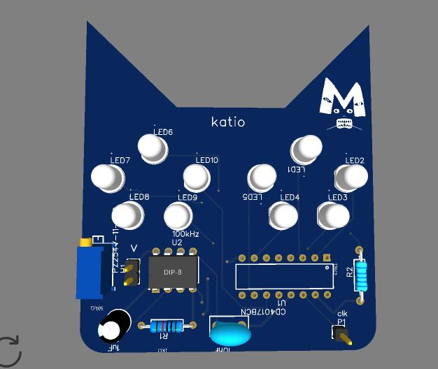

# 555-Chaser-blinky-
making the blinky board multiple leds chasing in a loop
im making the blinky board form the guided projects and i wanna modify the looks

starting at 2025/12/31 2:20 pm 

i'm making the blinky guided project to get more used to easyeda before i continue with my custom pcb on mp3 p v2 project i added all needed parts into the schematic on easyeda and read the whole tutorial on hackclub to understand all the points and have a general idea on how easyeda works finsihed reading at 2:55 pm

------------------------------
time now 2026/1/1 9:51 pm and things didn't go as planned i started this project to get experience dealing with easyeda to be able to complete my mp3 player project  but instead i got immersed with the mp3 player project and almost finished it but what i'm sure of now that's this project will be a peace of cake after what i learnt through these couple days 
right now i start this session at 2026/1/1 10:13 pm

 the idea will be a cat with eyes as leds 

  i connected the parts and used the net port that i just learned how to use and omd thank god that i noticed that the capacitor was reversed and i fixed that 
  
at 11:16 pm

done with the pcp and ordered the parts the wya i want the shape i choose to make was a cat so i drew the outline and then added the parts, the leds as eyes 5 leds each eye and the connetor on the ear 
took some time to connect everything and to order the parts and make them fit i'll add some typings now if there's space

i had this problem with the leds order and the eyes weren't symmetrical so i used the dimensions tool and measured and realigned the left eye 

to this 

done at  2026/1/2 12:50 am 
i'll try to finsih this project before i sleep becuase ny holiday ending tmrr technically it ended now i got a session at 7 am lol 

 i finished the connections and added a logo and my name on it and fixed all the drc errors , hvae been wiring it for hours now it's 3:9 am 

 ---------------------------------
 now i have finished this project had some nice time with it and i'm happy with the process i really had fun through everything even the PAINFUL steps and being scared at the beginning but still went for it (for my future self) i did this for u even if it wasn't much but i still did it keep going and tbh u just "can" 
